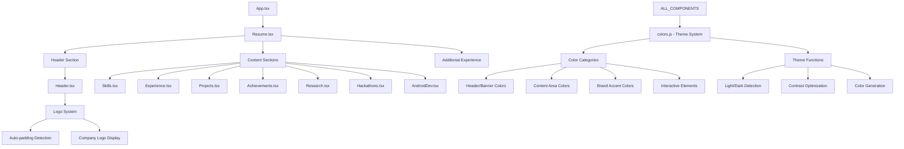
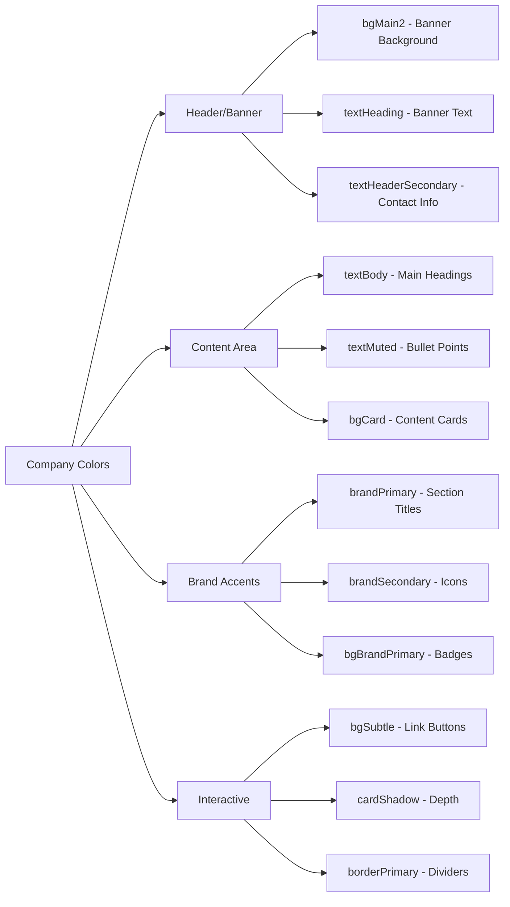
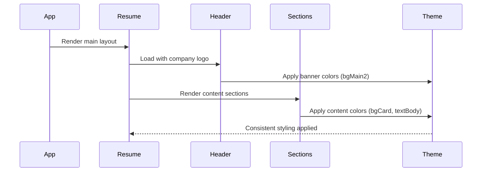
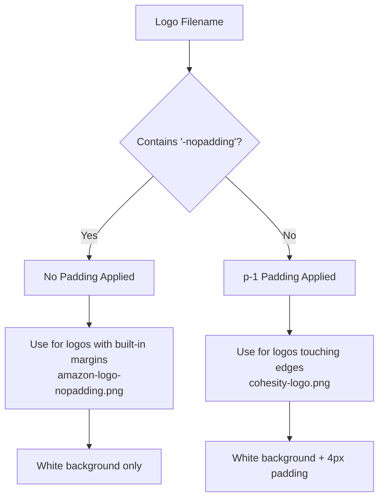
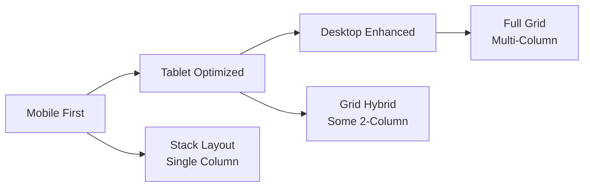

# 🎨 Company-Themed Resume System

A sophisticated React-based resume application that dynamically adapts to different company brand colors and themes. Perfect for job applications where you want your resume to match the company's visual identity while maintaining professional readability.

## 🌟 Key Features

### 🎯 **Dynamic Company Theming**

- **One-Click Company Switching**: Change entire resume theme by modifying a single variable
- **Professional Color Psychology**: Automatically balances brand colors with readability
- **Smart Contrast Detection**: Ensures optimal text visibility on any background
- **Multi-Company Support**: Pre-built themes for Amazon, Cohesity, Netflix (easily extensible)

### 🏗️ **Modular Architecture**

- **Component-Based Design**: Fully modular React components
- **Centralized Theming**: Single source of truth for all colors
- **Responsive Layout**: Mobile-first design with Tailwind CSS
- **Interactive Elements**: Hover effects, shadows, and smooth transitions

### 📄 **Complete Resume Sections**

- Professional header with company logo integration
- Technical skills with categorized display
- Work experience with detailed project descriptions
- Personal projects with live demos and GitHub links
- Research publications and achievements
- Education and certifications

## 🏛️ System Architecture



## 🎨 Revolutionary Theming System

### **The Magic of `colors.js`**

The entire theming system revolves around a sophisticated color management system in `src/theme/colors.js`:

#### **🔥 Core Innovation: Single Variable Company Switching**

```javascript
// Switch between company themes - ONE LINE CHANGE
export const theme = amazonLightColors;    // Amazon theme
export const theme = cohesityLightColors;  // Cohesity theme  
export const theme = netflixLightColors;   // Netflix theme
```

#### **🧠 Smart Color Categories**



#### **⚡ Critical Contrast Rule**

The system enforces a **MANDATORY** contrast rule:

- `bgMain2` (banner) and `bgBrandPrimary` (badges) MUST be visually contrasting
- Examples: Dark blue + Orange (Amazon), Black + Red (Netflix), Bright green + Dark gray (Cohesity)

#### **🎯 Variable Importance Hierarchy**

``` mermaid
graph TD
    A[🏆 TIER 1 - CORE IDENTITY<br/>Must Have Variables] --> A1[bgMain2<br/>Main banner background]
    A --> A2[bgBrandPrimary<br/>Secondary accent background]
    A --> A3[brandPrimary<br/>Main accent text]
    A --> A4[textBody<br/>Main heading text]
    
    B[🥈 TIER 2 - VISUAL HIERARCHY<br/>Highly Important] --> B1[brandSecondary<br/>Secondary accent text]
    B --> B2[textMuted<br/>Bullet point text]
    B --> B3[bgCard<br/>Content backgrounds]
    B --> B4[textHeading<br/>Banner text]
    
    C[🥉 TIER 3 - POLISH & CONSISTENCY<br/>Supporting Elements] --> C1[borderPrimary<br/>Section underlines]
    C --> C2[bgMain<br/>Page background]
    C --> C3[textHeaderSecondary<br/>Contact info text]
    C --> C4[bgSubtle/bgHover<br/>Link button states]
    
    style A fill:#ff6b6b,stroke:#d63031,stroke-width:3px,color:#fff
    style B fill:#feca57,stroke:#ff9ff3,stroke-width:2px,color:#2f3542
    style C fill:#48dbfb,stroke:#0abde3,stroke-width:2px,color:#2f3542
    
    style A1 fill:#ff7675,stroke:#d63031,color:#fff
    style A2 fill:#ff7675,stroke:#d63031,color:#fff
    style A3 fill:#ff7675,stroke:#d63031,color:#fff
    style A4 fill:#ff7675,stroke:#d63031,color:#fff
```




### **🤖 AI Assistant Integration**

The `colors.js` file includes comprehensive AI instructions for creating new company themes:

```javascript
/*
=== INSTRUCTIONS FOR AI ASSISTANTS ===
When user provides company logo/screenshots:
1. Extract 2-4 brand colors from materials
2. Create NEW color object (e.g., googleLightColors)
3. Use SAME variable names as amazonLightColors
4. Focus on Tier 1 variables first
5. Ensure bgMain2 and bgBrandPrimary contrast strongly
*/
```

## 🏗️ Component Architecture Deep Dive

### **📋 Resume Structure Flow**



### **🎨 Header Component Innovation**

The `Header.tsx` component features an advanced **Logo Padding System**:

#### **📁 Automatic Logo Handling**

```javascript
// Centralized logo configuration with auto-detection
const logoSrc = "/amazon-nopadding.png";  // Single source of truth

// Auto-detect padding needs from filename
const hasNoPadding = logoSrc.includes("-nopadding");
const paddingClass = hasNoPadding ? '' : 'p-1';
```

#### **🎯 Logo Filename Convention**



### **📊 Section Components**

Each section component follows a consistent pattern:

1. **Import theme colors** from centralized system
2. **Apply responsive design** with Tailwind classes
3. **Use semantic HTML** with proper accessibility
4. **Implement hover effects** for interactivity

#### **Example: Experience Section Structure**

```javascript
// Dynamic HTML content with theme colors
points: [
  `Building <span class="font-semibold ${theme.brandPrimary}">distributed systems</span>`,
  `Optimizing <span class="font-semibold ${theme.brandPrimary}">DAG execution</span>`
]

// Rendered with dangerouslySetInnerHTML for rich formatting
<span dangerouslySetInnerHTML={{ __html: point }}></span>
```

## 🚀 Getting Started

### **Prerequisites**

- Node.js 16+
- npm or yarn
- React 18+

### **Installation**

```bash
# Clone the repository
git clone [your-repo-url]
cd company-themed-resume

# Install dependencies
npm install

# Start development server
npm start
```

### **Quick Company Theme Switch**

1. **Choose your target company** (e.g., Google, Microsoft, etc.)
2. **Extract brand colors** from company logo/website
3. **Update `src/theme/colors.js`**:

```javascript
// Create new theme object
export const googleLightColors = {
  bgMain2: 'bg-[#4285F4]',        // Google blue banner
  bgBrandPrimary: 'bg-[#EA4335]', // Google red badges
  brandPrimary: 'text-[#4285F4]', // Blue accents
  brandSecondary: 'text-[#FBBC04]', // Yellow highlights
  // ... other colors
};

// Switch active theme
export const theme = googleLightColors; // Change this line
```

1. **Update logo** in `public/` folder following naming convention
2. **Update Header.tsx** logo source if needed

### **Logo Setup**

```javascript
// In src/components/sections/Header.tsx
const logoSrc = "/google-logo-nopadding.png";  // Update this line
```

## 🎯 Customization Guide

### **Adding New Sections**

1. Create component in `src/components/sections/`
2. Import and add to `Resume.tsx`
3. Follow existing pattern with theme colors
4. Add to responsive grid layout

### **Modifying Content**

- **Personal Info**: Update `Header.tsx`
- **Skills**: Modify `Skills.tsx`
- **Experience**: Update `Experience.tsx` data arrays
- **Projects**: Modify `Projects.tsx` data arrays

### **Advanced Theme Customization**

For complex branding needs:

```javascript
// Use utility functions for advanced color manipulation
import { darkenColor, isLightColor, getOptimalButtonTextColor } from './colors.js';

const customTheme = {
  bgMain2: 'bg-[#YOUR_COLOR]',
  textHeading: isLightColor('#YOUR_COLOR') ? 'text-gray-800' : 'text-white',
  // Auto-calculated optimal contrast
}
```

## 🛠️ Technology Stack

### **Frontend Framework**

- **React 18** - Modern component-based architecture
- **TypeScript** - Type-safe development
- **Tailwind CSS** - Utility-first styling system

### **Development Tools**

- **Vite** - Fast build tool and dev server
- **Lucide React** - Beautiful icon library
- **ESLint/Prettier** - Code quality and formatting

### **Deployment Ready**

- **Responsive Design** - Mobile-first approach
- **SEO Optimized** - Semantic HTML structure
- **Performance** - Optimized bundle size
- **Accessibility** - WCAG compliant

## 📱 Responsive Design



### **Breakpoint Strategy**

- **Mobile**: Stack all content vertically
- **Tablet** (md:): 2-column grid for achievements, research
- **Desktop** (lg:): Full multi-column layouts

## 🔧 File Structure

```
src/
├── components/
│   ├── sections/           # Main resume sections
│   │   ├── Header.tsx     # Logo + contact info + education
│   │   ├── Skills.tsx     # Technical skills display
│   │   ├── Experience.tsx # Work experience timeline
│   │   ├── Projects.tsx   # Personal projects showcase
│   │   ├── Achievements.tsx # Awards and recognitions
│   │   ├── Research.tsx   # Research papers and publications
│   │   ├── Hackathons.tsx # Hackathon projects
│   │   └── AndroidDev.tsx # Mobile development projects
│   └── ui/                # Reusable UI components
│       ├── SectionTitle.tsx # Consistent section headers
│       └── [Other UI components...]
├── theme/
│   └── colors.js          # 🎨 CORE THEMING SYSTEM
├── App.tsx               # Main app wrapper
├── Resume.tsx            # Resume layout orchestrator
└── index.tsx             # React app entry point
```

## 🎨 Design Philosophy

### **Color Psychology Integration**

- **Professional First**: Readability over brand loyalty
- **Strategic Accents**: Brand colors used purposefully
- **Hierarchy Respect**: Visual importance through color weight
- **Accessibility**: WCAG AA contrast compliance

### **User Experience Principles**

- **Scan-Friendly**: Important info stands out immediately
- **Context Switching**: Easy theme changes for different applications
- **Progressive Enhancement**: Works on all devices and screen sizes
- **Performance**: Fast loading with optimized assets

## 🤝 Contributing

### **Adding New Company Themes**

1. **Fork the repository**
2. **Extract company brand colors** from official materials
3. **Create new theme object** in `colors.js`
4. **Test contrast and readability**
5. **Submit pull request** with screenshots

### **Component Improvements**

1. **Follow existing patterns** for consistency
2. **Maintain responsive design** principles
3. **Use theme colors** from centralized system
4. **Add TypeScript types** for props
5. **Test across different themes**

## 📋 TODO & Roadmap

### **Immediate Improvements**

- [ ] Add more pre-built company themes (Google, Microsoft, Apple)
- [ ] Dark mode support for each company theme
- [ ] PDF export functionality with theme preservation
- [ ] Theme preview gallery

### **Advanced Features**

- [ ] Real-time theme editor in browser
- [ ] Color palette generator from logo upload
- [ ] Multiple resume layouts (creative, traditional, minimal)
- [ ] Animation system for section transitions

### **Developer Experience**

- [ ] Storybook integration for component development
- [ ] Automated theme contrast validation
- [ ] CLI tool for quick theme generation
- [ ] Theme marketplace/sharing system

## 📄 License

This project is open source and available under the [MIT License](https://claude.ai/chat/LICENSE).

## 🙋‍♂️ Support & Questions

For questions, suggestions, or support:

1. **Create an issue** for bugs or feature requests
2. **Start a discussion** for general questions
3. **Check existing themes** in `colors.js` for examples
4. **Follow the AI instructions** in `colors.js` for theme creation

------

*Built with ❤️ for developers who want their resumes to match their dream company's brand while maintaining professional excellence.*
